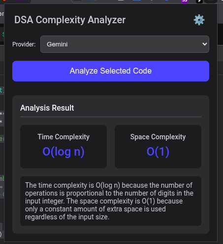

# DSA Complexity Analyzer



This browser extension helps you analyze the time and space complexity of code snippets directly in your browser.

## Features

*   **Analyze Code Complexity:** Get the time and space complexity of your selected code.
*   **Multiple Providers:** Choose between different analysis providers like Gemini, OpenAI, or a local model.
*   **Easy to Use:** A simple and intuitive interface for quick analysis.

## Installation

> [!NOTE]  
> This extension is intended for Chrome and other Chromium-based browsers (e.g., Microsoft Edge, Brave).

To install this extension, you can load it as an unpacked extension in a Chromium-based browser (like Chrome, Edge, or Brave).

1.  **Download the project:** Clone this repository or download it as a ZIP file and unzip it.
    ```bash
    git clone https://github.com/Nishanthnaa52/DSA-Complexity-Analyzer.git
    ```
2.  **Open your browser's extension page:** Navigate to `chrome://extensions` in your browser.
3.  **Enable Developer Mode:** Make sure the "Developer mode" toggle in the top-right corner is switched on.
4.  **Load the extension:**
    *   Click the **"Load unpacked"** button.
    *   Navigate to and select the project directory (`DSA-Complexity-Analyzer`) that you downloaded.

The extension icon should now appear in your browser's toolbar.

## Usage

1.  **Select Code:** On any webpage, use your mouse to highlight the code snippet you want to analyze.
2.  **Open the Extension:** Click on the DSA Complexity Analyzer icon in your browser's toolbar to open the popup.
3.  **Choose a Provider:** Select your preferred analysis provider from the dropdown menu.
4.  **Analyze:** Click the "Analyze Selected Code" button. The time and space complexity results will appear in the popup.